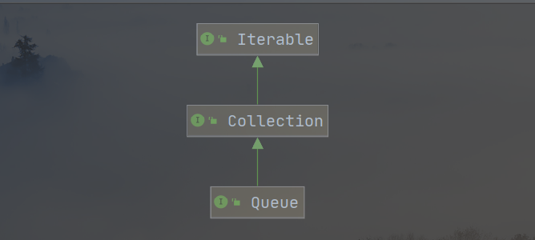

[TOC]

# 1. 课后作业

## 1.1 改写 Deque 的代码

```java
public static void main(String[] args) {
    Deque<String> deque = new LinkedList<>();
    deque.addLast("first-element");
    deque.addLast("second-element");
    deque.addLast("third-element");
    System.out.println("deque >>> " + deque);
    // will not remove the frist element
    String str = deque.peekFirst();
    System.out.println("peekFirst >>> " + str);
    System.out.println("deque >>> " + deque);
    while(true) {
        // remove element from the front
        System.out.println(deque.pollFirst());
        if (deque.isEmpty())
            break;
    }
    System.out.println("deque >>> " + deque);

}
```

运行结果：


## 1.2 分析 Queue 的源码

类继承关系图：



Queue 继承了 Collection 的所有接口方法和成员变量，并在其之上扩展了额外的 **插入**、**取出**、**访问** 操作。每种操作**失败**时都有两种类型的返回值：

- 抛出异常
- 返回一个 特定 的值：`null` 或者 `false`，取决于操作的类型

队列有很多种实现方式，不一定通过 FIFO 形式对元素进行排列，例如 **优先级队列**，元素可按照元素 **自定义比较器** 或者 **自然顺序** 进行排序，可以实现 按照元素优先级 进行出队入队操作，甚至可以利用优先级排序实现 FILO 队列（栈）；无论排序的方式是什么，在 FIFO 队列中，队列的头部 head 必定是弹出队列的第一个元素，队列的尾部 tail 必定是下一个元素插入队列的位置。在其它实现方式情况下，例如 **双端队列**，元素的出队和入队操作不一定严格限定于队列的某一端。


### Queue 方法解析

Queue 中可扩展的方法：


|         | Throw Exception  | Returns special value |
| ------- | ---------------- | --------------------- |
| Insert  | add(E) : boolean | offer(E) : boolean    |
| Remove  | remove() : E     | poll() : E            |
| Examine | element() : E    | peek() : E            |

方法详解：

- **offer(E) : boolean 和 add(E) : boolean**

如果 element 插入队列失败，则返回 `false`，与 Collection 的 add() 方法不同，它在失败时返回一个正常值，而不是抛出异常，例如在 有界队列 情况下，有可能会插入失败。

- **remove() : E 和 poll() : E**

它们两个的唯一不同点是在 **队列为空** 的情况下采取的操作不同，remove 操作空队列会抛出异常，而 poll 会返回 `null`

- **element() : E 和 peek() : E**

它们都会去访问队列的首个元素，但是**不会将元素弹出队列**。

### BlockingQueue 阻塞队列

在 Queue 中没有看到线程安全的 阻塞队列 的相关方法，因为 阻塞队列 存在于 `JUC `下的 BlockingQueue 接口，继承于 Queue 接口。


### Queue 不允许插入 null 值

在 Queue 中，peek() 和 poll() 在访问空队列时会返回 null，该 null 值表示队列为空，即使像 LinkedList 并不禁止插入 null 值，在 Queue 体系中，尽量不要插入 null 值，因为**该值代表队列没有存储元素**。

# 2. 学习总结


## 2.1 数组和链表

本周对 数组、链表 和 栈、队列进行深入的学习，数组和链表是数据结构中**两种不同的存储结构**，所有的其它数据结构底层方式都是在这两种存储结构之间选择其一，所以需要理解它们在存储结构方面的异同：

- 数组

它是一种**连续存储**的数据结构，可以在 **O(1)** 时间复杂度下**随机访问元素**，但是在**插入、删除**操作中，表现得很差，平均情况下需要 **O(N)** 的时间复杂度。

- 链表

它是一种**离散存储**的数据结构，由于地址的不连续性，使其**不具备随机访问元素**的特性，在 **O(N)** 时间复杂度下访问一个元素，但是在**插入、删除**操作中表现出良好的性能，可以在 **O(1)** 的时间复杂度下完成。

|      | 访问元素 | 插入、删除元素 |
| :--: | :------: | :------------: |
| 数组 |   O(1)   |      O(N)      |
| 链表 |   O(N)   |      O(1)      |

链表既然只有 O(N) 的访问时间复杂度，如何提升访问性能呢？

思想：**升维，用空间换取时间，将一维升为二维，二维升为三维······**

原来的链表只能**一个一个**访问元素，把间隔调大为 2 ，将间隔为 2 的链表元素抽取到上一层，形成一条新的链表，链表中的每个节点都有两个指针：**指向同一条链表的下一节点、指向下一条链表的同一节点**，遍历查找元素 A 的过程如下：

- 如果元素A比当前节点大，比较下一节点与元素A的值
- 如果比元素A大，则跳到下一节点，否则，前往下一层链表查找元素A
- 重复第1、2步，直到找到元素A，或者判断元素A不存在于链表中

这样的一个过程使得链表的访问时间提升到 O(logN)，这种数据结构也称为 **跳表**。

跳表被应用到 Redis 中，具有良好的性能，且结构简单

## 2.2 栈和队列

- 栈

栈是一种**先入后出**型数据结构，它是一种线性的数据结构，在底层存储结构可以选用 数组 或 链表 都可以实现，根据不同的实现方式，**访问元素**的时间复杂度均是 **O(1)**，因为栈**只能访问栈顶元素**，在**插入、删除**元素的时间复杂度也是 **O(1)**，因为在同一时间只能在栈顶进行插入和删除元素操作。

- 队列

队列是一种**先入先出**型数据结构，它同样也是一种线性数据结构，在**访问、插入和删除**操作，时间复杂度均是 **O(1)**，访问元素可以从队列的头部或尾部进行访问，插入操作只能在队列的尾部插入，删除操作只能在队列的头部删除。

|      | 插入 | 删除 | 访问 |
| :--: | :--: | :--: | :--: |
|  栈  | O(1) | O(1) | O(1) |
| 队列 | O(1) | O(1) | O(!) |

队列有许多衍生出来的其它高级数据结构：

- 双端队列：队列的头部和尾部均可以进行插入和删除操作
- 优先级队列：队列中的元素按照优先级排序，按照元素的优先级大小进行出队
- ······
- 循环队列：队列的尾部连接到队列的头部

这些高级数据结构存在的目的是**使所有操作都变得更加优雅**，为人类服务，掌握了基础数据结构的原理之后，泛化后的数据结构只不过是一些变形。

这一周是第一周，本周的 LeetCode 练习题对于本人来说，链表部分较为薄弱，因为链表本身不难，难在对指针的操作要求较高，后面会多加练习，栈和队列的题目多数有套路，通过题解的学习可以掌握。

本周难题：

- [柱状图中最大的矩形](https://leetcode-cn.com/problems/largest-rectangle-in-histogram)

- [滑动窗口最大值](https://leetcode-cn.com/problems/sliding-window-maximum)

- [接雨水](https://leetcode.com/problems/trapping-rain-water/)
- [盛最多水的容器](https://leetcode-cn.com/problems/container-with-most-water/)
- [三数之和](https://leetcode-cn.com/problems/3sum/)

- [反转链表](https://leetcode.com/problems/reverse-linked-list/)（字节跳动、亚马逊在半年内面试常考）
- [两两交换链表中的节点](https://leetcode.com/problems/swap-nodes-in-pairs)（阿里巴巴、字节跳动在半年内面试常考）
- [环形链表](https://leetcode.com/problems/linked-list-cycle)（阿里巴巴、字节跳动、腾讯在半年内面试常考）
- [环形链表 II](https://leetcode.com/problems/linked-list-cycle-ii)
- [K 个一组翻转链表](https://leetcode.com/problems/reverse-nodes-in-k-group/)（字节跳动、猿辅导在半年内面试常考）

之后对这些题目增大练习强度，谢谢你仔细的阅读，请您务必给我提一些建议和意见！这将会对我非常有用！

<hr>

- 联系人：曾智杰

-  联系邮箱：jie534838094@163.com

- 个人博客主页：http://smallpineapple.top

