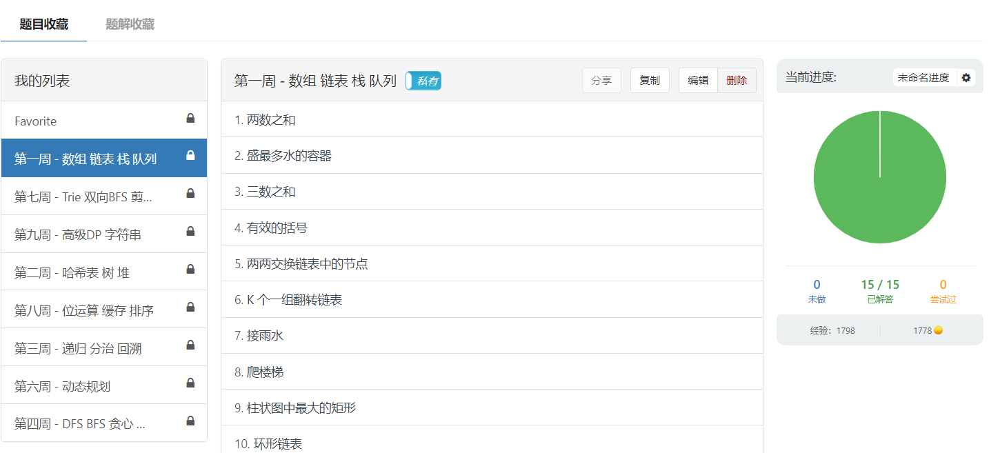
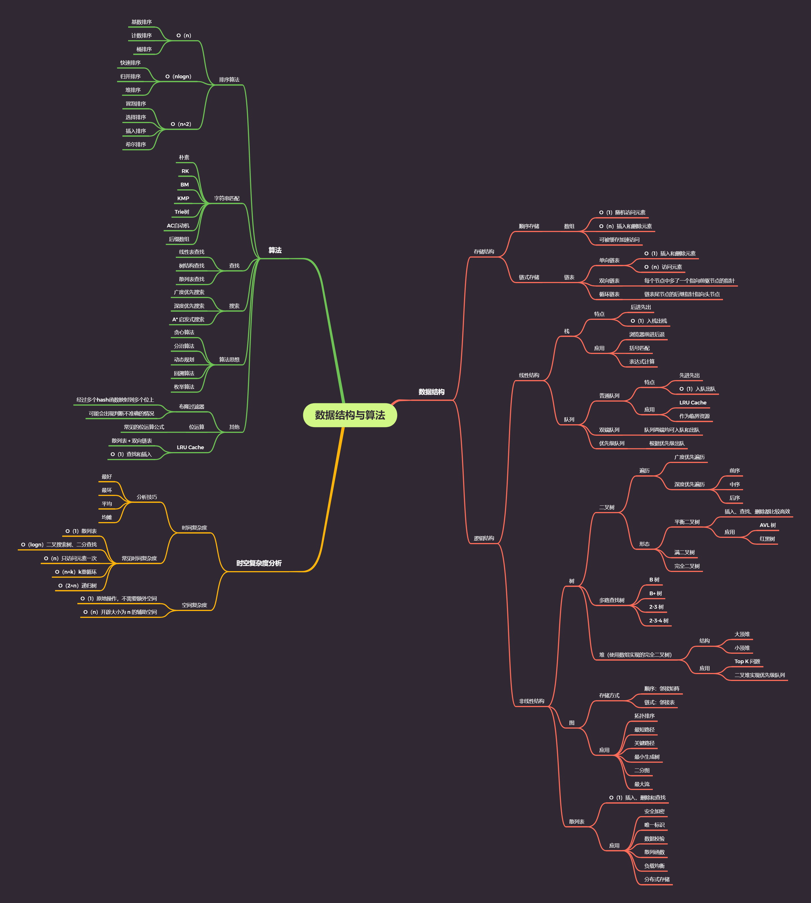

# 期末总结

到今天为止，极客大学算法训练营进入了尾声，在这过程中收获颇多，从一开始的盲目刷题，到现在的五毒神掌，超哥给了非常多很好很忠实的建议给我：

1. 刷题最大的误区：**只做一遍**
2. 五毒神掌：第一遍**看题解**学习，第二遍**不看代码自己实现出来**，第三遍**过了一天后再写一遍**，第四遍**过了一周后再写一遍**，第五遍**面试前再复习一遍**
3. **多看国际站**上面的优秀代码，把别人的优秀代码理解下来后，就可以变成是自己的知识了

说一说这十周以来的学习吧，首先前四周的知识较为熟悉，学习任务也不算太繁重，很快就可以完成作业了，随着后面课程难度的升高，相同的题量，加大了难度，有些打击自信心，而且花费的时间也变长了，所以我相信我的学习热情是有所下降的，当然，每一节课我都有认真地听讲，把所有的题目都做成列表收藏在LeetCode当中，在之后没有超哥的日子，我可以随时每周复习一个专题，可以总结出一套自己的算法体系。

还是课程开始总结的算法与数据结构脑图，现在看这张脑图，感觉里面很多知识点都掌握了，能够说清楚它们的特点，当然少不了的是继续加强练习，加强自身的算法逻辑能力。

最后，感谢极客大学算法训练营，让我有了进步，有了算法训练的方向，我会再接再厉，继续前进！有缘再见！